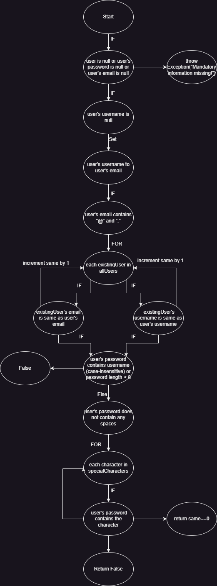

# Втора лабораториска вежба по Софтверско инженерство

## Христијана Синдилиева, бр. на индекс 151150

###  Control Flow Graph

### Цикломатска комплексност

Цикломатската сложеност може да се одреди со помош на формулата:

M = E - N + 2P

Каде:
M = Цикломатска сложеност
E = Број на рабови (врски ) во графикот
N = Број на јазли во графикот
P = Број на поврзани компоненти (обично 1 за една програма)

M = 19 - 16 + 2(1)
М = 3 + 2
М = 5

### Тест случаи според критериумот  Every statement 

....

### Тест случаи според критериумот Every path

.... 

### Објаснување на напишаните unit tests

...
...